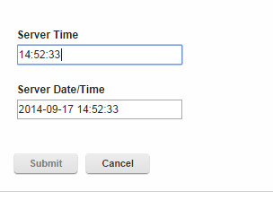
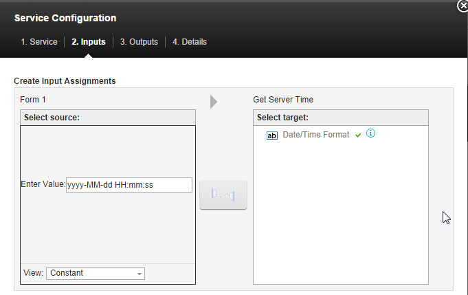

# Get Server Time

This is a custom transport that can be used to return the server time.

## Input Parameter

The Format of the Date/Time to be returned.  The following pattern letters can be used to define the format to return the server date/time:

**G**	Era designator, Text, e.g.	AD
**y**	Year, e.g. 1996; 96
**Y**	Year, e.g.2009; 09
**M**	Month in year, e.g.	July; Jul; 07
**w**	Week in year, Number, e.g.	27
**W**	Week in month,	Number, e.g.	2
**D**	Day in year,	Number, e.g.	189
**d**	Day in month,	Number, e.g.	10
**F**	Day of week in month,	Number, e.g.	2
**E**	Day name in week, Text, e.g.	Tuesday; Tue
**u**	Day number of week (1 = Monday, ..., 7 = Sunday),	Number, e.g.	1
**a**	Am/pm marker,	Text, e.g.	PM
**H**	Hour in day (0-23),	Number, e.g.	0
**k**	Hour in day (1-24),	Number, e.g.	24
**K**	Hour in am/pm (0-11),	Number, e.g.	0
**h**	Hour in am/pm (1-12),	Number, e.g.	12
**m**	Minute in hour,	Number, e.g.	30
**s**	Second in minute,	Number, e.g.	55
**S**	Millisecond,	Number, e.g.	978
**z**	Time zone,	General time zone, e.g.	Pacific Standard Time; PST; GMT-08:00
**Z**	Time zone,	RFC 822 time zone, e.g.	-0800
**X**	Time zone,	ISO 8601 time zone, e.g.	-08; -0800; -08:00

## Output Parameter

Server Time - Returns the time in the format specified by the input parameter.  Default is HH:mm:ss.

Result - Returns 200 if service completes successfully

## Installation instructions

1. Deploy the .jar file to the extensions directory (/opt/HCL/Leap/extensions or c:\HCL\Leap\extensions)

2. Deploy the .xml file to the ServiceCatalog/1 directory.

3. A restart is not required, in about 60 seconds the service should appear within Leap.

**Note:** To apply a custom format:

- Select the input tab.

- Change the view to 'Constant' and enter the desired format string (e.g. 'yyyy-MM-dd HH:mm:ss').

- Select "Date/Time Format" in the target and click the connection button in the middle.

